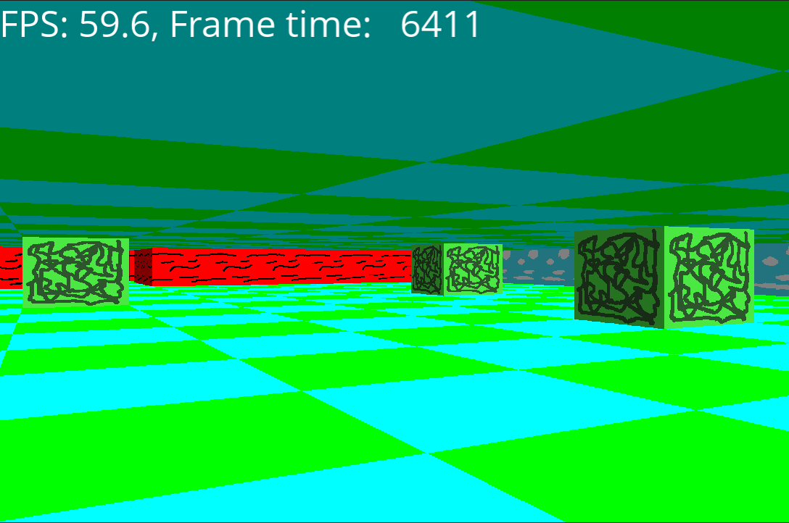

# adventure3d
Simple raycaster using SFML

Just 1 file (scr/main.cpp) with a novel approach to raycasting, sending line data to the GPU, using SFML.

I based this on the raycasting tutorial at [lodev](http://lodev.org/cgtutor/raycasting.html)
I was inspired after seeing [awk-raycaster](https://github.com/TheMozg/awk-raycaster) on the Github popular projects list. I thought if someone can make a raycaster in less than 700 lines of AWK code, I could do it with C++ and SFML.

Released under GNU GPLv3, see also [LICENSE](LICENSE). Though some code is taken from the raycasting tutorial and copyright by Lode Vandevenne. Its license is in [LICENSE.tutorial](LICENSE.tutorial). I've improved and SFML-ified many parts, but the basic calculations often use the same code.

The project uses the Open Sans font, which is under the [Apache license](data/font/Apache License.txt).

Textures from the [SuperTuxKart](https://supertuxkart.net/) project, downloaded from [OpenGameArt](http://opengameart.org/content/supertuxkart-basic-sameless-texture-pack) and released under [CC-BY-SA 3.0](https://creativecommons.org/licenses/by-sa/3.0/legalcode)
